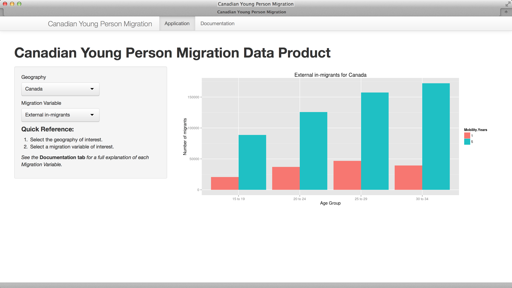
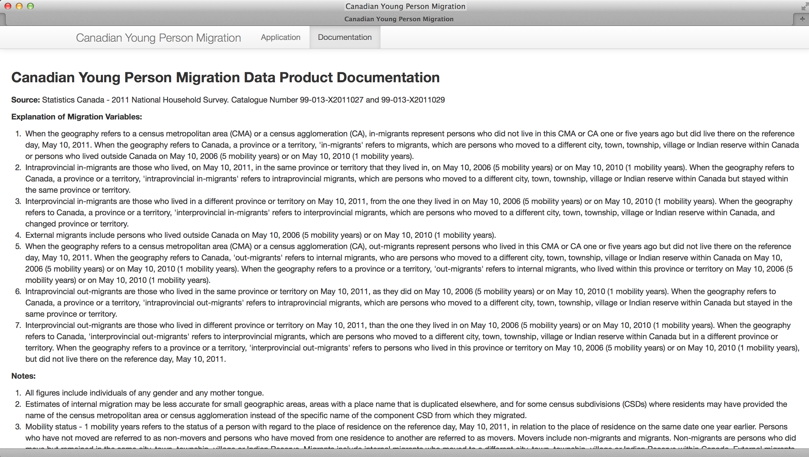

## Why this data product, why now?

* There has been much discussion, especially within Atlantic Canada, with respect 
to the "brain drain" of young people "moving west" in search of high-paying jobs
in the oil and gas sector.

* Statistics Canada conducted a National Household Survey (NHS) in 2011 that
explicitly addressed the question of migration and mobility in Canada.

* A new data set, derived from the StatsCan NHS Data Tables (catalogue numbers 
[99-013-X2011026](http://www12.statcan.gc.ca/nhs-enm/2011/dp-pd/dt-td/Ap-eng.cfm?LANG=E&APATH=3&DETAIL=0&DIM=0&FL=A&FREE=0&GC=0&GID=0&GK=0&GRP=0&PID=105554&PRID=0&PTYPE=105277&S=0&SHOWALL=0&SUB=0&Temporal=2013&THEME=97&VID=0&VNAMEE=&VNAMEF=)
and 
[99-013-X2011028](http://www12.statcan.gc.ca/nhs-enm/2011/dp-pd/dt-td/Ap-eng.cfm?LANG=E&APATH=3&DETAIL=0&DIM=0&FL=A&FREE=0&GC=0&GID=0&GK=0&GRP=0&PID=105579&PRID=0&PTYPE=105277&S=0&SHOWALL=0&SUB=0&Temporal=2013&THEME=97&VID=0&VNAMEE=&VNAMEF=)) 
was created specifically for this data product to investigate 
mobility and migration of young people (ages 15-34).

* This new data set, when combined with an accompanying interactive web application, 
lets you _easily_ explore the migration patterns of young people within Canada.

* Find answers to current questions concerning the mobility of young people in 
Canada _for yourself_ that are _backed up by solid data_.

--- .class #id 

## Advantages

There are several key advantages this data product has over the StatsCan NHS migration
and mobility data products:
        
    
1. The NHS mobility 5 years ago (
[99-013-X2011026](http://www12.statcan.gc.ca/nhs-enm/2011/dp-pd/dt-td/Ap-eng.cfm?LANG=E&APATH=3&DETAIL=0&DIM=0&FL=A&FREE=0&GC=0&GID=0&GK=0&GRP=0&PID=105554&PRID=0&PTYPE=105277&S=0&SHOWALL=0&SUB=0&Temporal=2013&THEME=97&VID=0&VNAMEE=&VNAMEF=))
and mobility 1 year ago (
[99-013-X2011028](http://www12.statcan.gc.ca/nhs-enm/2011/dp-pd/dt-td/Ap-eng.cfm?LANG=E&APATH=3&DETAIL=0&DIM=0&FL=A&FREE=0&GC=0&GID=0&GK=0&GRP=0&PID=105579&PRID=0&PTYPE=105277&S=0&SHOWALL=0&SUB=0&Temporal=2013&THEME=97&VID=0&VNAMEE=&VNAMEF=))  
NHS data products are combined into a __single data product__.
2. This data product is __focused__ on the mobility of young people and, as such, 
is organized and presented in a way that serves this specific research topic more 
readily than the more general purpose NHS data products.
3. Mobility data is presented in a __graphical chart__ form, rather than the tabular 
form provided by the NHS data products. 
<br>
The result is new data product is __very easy to use__ to simplify the research efforts of even the most 
casual user.

--- .class #id 

## Features

* Multiple migration variables are available, including: 
```{r show-data, echo=FALSE, size="small"}
data <- read.csv("CDN-NHS-2011-Migration.csv", stringsAsFactors=FALSE)
data$Age.Group <- factor(data$Age.Group)
data$Mobility.Years <- factor(data$Mobility.Years)
variable.choices <- colnames(data)[-c(1:3)]
names(variable.choices) <- sub("-"," ", gsub("\\.","-",variable.choices))
noquote(names(variable.choices))
```
* Data for areas ranging from the entire country, to each province _and_ major cities/towns.
* Side-by-side comparision of 5 year and 1 year mobility
<center>
```{r show-plot, echo=FALSE, fig.height=3, fig.width=6}
library(ggplot2)
anArea <- "New Brunswick"
selected.area <- data[data$Area == anArea,]
aVariable <- "Interprovincial.out.migrants"
p <- ggplot(selected.area, aes_string(x="Age.Group", y=aVariable, fill="Mobility.Years")) + 
    geom_bar(stat="identity", position="dodge") +
    xlab("Age Group") +
    ylab("Number of migrants") +
    ggtitle(paste(sub("-"," ", gsub("\\.","-",aVariable)), "for", anArea))
print(p)  
```
</center>
* Extensive documentation explaining each of the migration variables.

--- .class #id 

## Screenshots
<br>
The screenshots below show the easy-to-use application tab as well as
the documentation tab that provides comprehensive documentation on the meaning 
of each migration variable as well as information on how to interpret the data 
at various geographic levels.
<br>
<div>


</div>
<br>
<center>__[Try it NOW!](http://rickcoates.shinyapps.io/can-nhs-2011-migration/)__</center>


